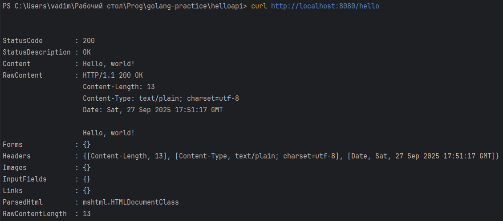
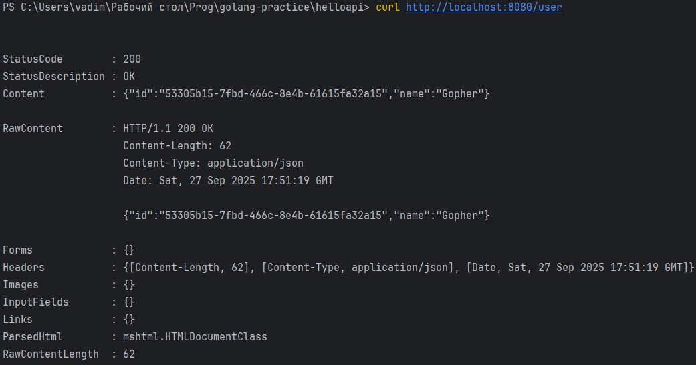
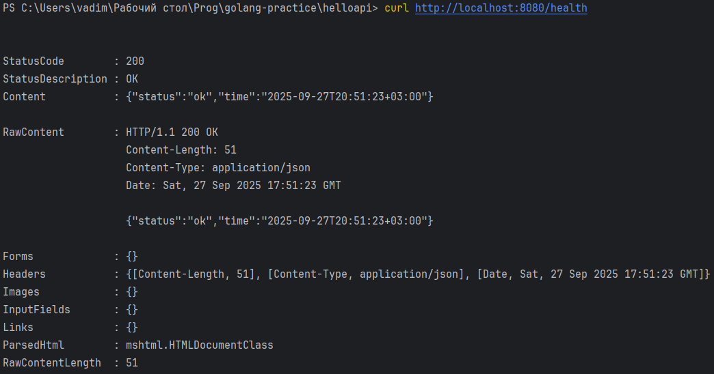
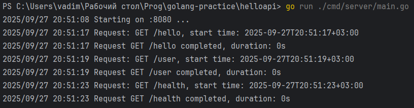

# Практическая работа № 1 - Юркин В.И.

## Описание проекта
Проект направлен на обучение основам golang, а именно созданию простейшего HTTP-сервиса

Задание:
- Установить Go и Git, проверить версии.
- Инициализировать модуль Go в новом проекте.
- Реализовать HTTP-сервер с маршрутами /hello (текст) и /user (JSON).
- Подключить внешнюю библиотеку (генерация UUID) и использовать её в /user.
- Запустить и проверить ответы curl/браузером.
- Собрать бинарник .exe и подготовить README и отчёт.


##	Структура проекта
```
helloapi/
│
├── cmd/
│   └── server/      
│       └── main.go        # Точка входа для запуска сервера
│
├── internal/              # Внутренние пакеты для основной логики
│   ├── handlers/          # Обработчики для различных HTTP-эндпоинтов
│   └── middlewares/       # Пользовательские middleware-слои
│
├── go.mod                 # Конфигурационный файл модуля Go
├── go.sum                 # Файл чексума зависимостей
```


## Установка и запуск

### После клонирования репозитория:
```bash
cd helloapi
```

Установка зависимостей
```bash
go mod tidy
```

### Отладка
Запуск проекта в режиме разработки
```bash
go run ./cmd/server/main.go
```

### Билд
Билд проекта
```bash
go build -o helloapi.exe ./cmd/server
```
Запуск билда
```bash
.\helloapi
```

## Примеры запросов

```bash
curl http://localhost:8080/hello
```

```bash
curl http://localhost:8080/user
```

```bash
curl http://localhost:8080/health
```

## Конфигурация
Переменные окружения:
 - APP_PORT - порт, на котором работает сервер (необязательно, по-умолчанию 8080)

## Скриншоты работы
### Результат запроса /hello

### Результат запроса /user

### Результат запроса /health

### Логи сервера
